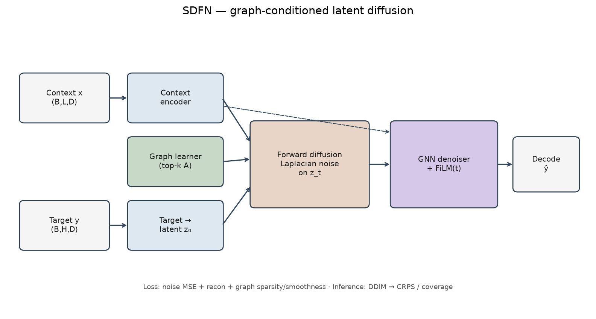

# SDFN

Graph-conditioned latent diffusion for probabilistic multivariate forecasting.

Learns a sparse feature graph from context, runs Laplacian-structured noise in a per-variable latent space, and denoises with a FiLM-conditioned GNN. Reports CRPS and interval coverage in addition to MSE/MAE.



## Setup

```bash
python -m venv .venv && source .venv/bin/activate
pip install -r requirements.txt
```

ETT CSVs go in `data/` (or set `--data_dir`). For traffic:

```bash
python download_data.py --dataset metr-la
```

## Train

```bash
# ETT
python train.py --dataset ETTh1 --data_dir ../data \
  --context_len 336 --pred_len 96 --epochs 50 --save_dir checkpoints/etth1

# traffic (after download)
python train.py --dataset metr-la \
  --data_path data/metr-la.h5 --adj_path data/adj_mx.pkl \
  --context_len 12 --pred_len 12 --epochs 100
```

Checkpoints and a results JSON land in `--save_dir`. Probabilistic eval uses DDIM (`--eval_steps`, `--test_samples`).

## Results

~0.90M parameters. Protocol: train-only z-score + RevIN; 20 DDIM samples for CRPS / coverage. Source: [`results/summary.json`](results/summary.json).

**ETT, L=336, H=96 (seed 42)**

| Dataset | MSE   | MAE   | CRPS  | Cov@90 |
|---------|-------|-------|-------|--------|
| ETTh1   | 0.882 | 0.640 | 0.448 | 0.51   |
| ETTh2   | 0.573 | 0.530 | 0.453 | 0.22   |
| ETTm1   | 0.750 | 0.568 | 0.453 | 0.32   |
| ETTm2   | 0.407 | 0.410 | 0.287 | 0.54   |

Well-calibrated 90% intervals would sit near Cov@90 ≈ 0.90. Current coverage is low — treat UQ as a prototype, not deployment-ready.

Point accuracy is below strong deterministic transformers on several ETT splits. Natural next use case is traffic (METR-LA / PEMS-BAY) with CRPS vs other diffusion forecasters.

## Layout

```
train.py             # training + probabilistic eval
download_data.py     # METR-LA / PEMS-BAY helpers
src/model.py         # graph learner, diffusion, GNN denoiser
src/data.py
src/metrics.py       # MSE/MAE, CRPS, coverage
results/summary.json
figures/architecture.png
```

## Stack

PyTorch · NumPy · Pandas · SciPy · h5py
